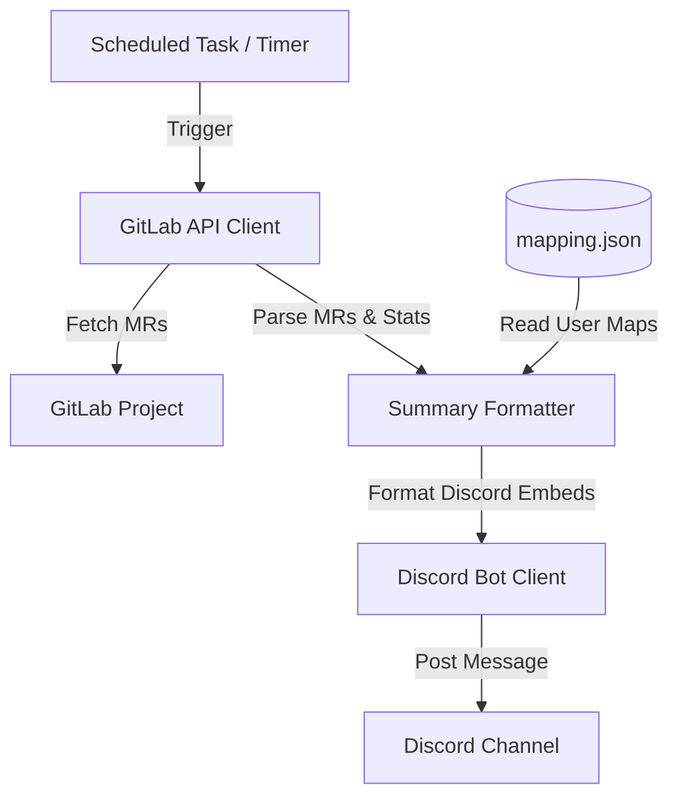

# Technical Specification: GitLab-Discord MR Summary Bot

## 1. Overview
The **GitLab-Discord MR Summary Bot** is a Python service designed to pull Merge Requests (MRs) from a GitLab project, parse their status based on labels (`awaiting review`, `changes requested`), and post a structured, visually appealing daily/scheduled summary to a specific Discord channel. It maps GitLab users to Discord accounts to mention them directly.

## 2. System Architecture



## 3. Configuration & Environment Variables
The application will read settings from a `.env` file and a local JSON mapping file.

### Environment Variables (`.env`)
- `DISCORD_TOKEN` (string): The Discord Bot API token.
- `DISCORD_CHANNEL_ID` (integer): Snowflake ID of the channel where the bot posts summaries.
- `GITLAB_TOKEN` (string): Personal Access Token or Project/Group Access Token for GitLab.
- `GITLAB_PROJECT_ID` (integer/string, optional): The path or ID of the GitLab project (e.g. `1234567` or `namespace/project`).
- `GITLAB_GROUP_ID` (integer/string, optional): The path or ID of the GitLab group (e.g. `98765` or `namespace/group`). If set, the bot will fetch MRs for the entire group.
- `GITLAB_URL` (string, optional): Base GitLab URL. Defaults to `https://gitlab.com`.
- `SUMMARY_INTERVAL_HOURS` (integer, optional): Interval between automatic summaries. Defaults to `24`.
- `STALE_THRESHOLD_DAYS` (integer, optional): Number of days of inactivity before an MR is marked "stale". Defaults to `3`.

### User Mapping File (`app_build/mapping.json`)
A static JSON map of GitLab usernames to Discord user IDs.
```json
{
  "gitlab_author_username": "discord_user_id_snowflake",
  "gitlab_reviewer_username": "discord_user_id_snowflake"
}
```

## 4. GitLab Data Collection & Rules
The bot connects to the GitLab API via `python-gitlab` (or `requests`) and fetches all `opened` MRs for the specified project.

### Parsing Logic
1. **Filter Out Drafts**: Skip MRs marked as `draft` or `work_in_progress` unless explicitly configured.
2. **"Awaiting Review" MRs**:
   - Identified by label: `awaiting review`.
   - Action Required: Must be reviewed.
   - Assigned to: Check MR `assignees` (plural) and `reviewers`.
   - If no assignee/reviewer is found, mark as **"Needs Reviewer Assignment"**.
   - If assignees are present, associate the MR with those reviewers.
3. **"Changes Requested" MRs**:
   - Identified by label: `changes requested`.
   - Action Required: MR author needs to make changes.
   - Associated to: MR `author.username`.
4. **Reviewer Workload**:
   - Count the total number of opened MRs currently assigned to each reviewer.
5. **Stale MRs (Creative Addition)**:
   - Identify MRs whose `updated_at` timestamp is older than `STALE_THRESHOLD_DAYS` ago.
   - Flag them to prompt progress.

## 5. Discord Posting & Formatting
The summary will be posted as a Discord Rich Embed with curated colors (e.g. slate-blue theme for a premium feel) containing:
- **Title**: 🤖 GitLab Merge Request Daily Summary
- **Color**: `#3498db` (or similar hex)
- **Fields**:
  - **Awaiting Review (X MRs)**:
    - Lists MR titles (linked to GitLab) and pings the assigned reviewers (e.g. `<@discord_id>` if mapped, or `@gitlab_username` if not).
  - **Changes Requested (Y MRs)**:
    - Lists MR titles and pings the author (e.g. `<@discord_id>` if mapped, or `@gitlab_username` if not).
  - **Reviewer Workloads**:
    - A summary breakdown showing how many MRs are on each reviewer's plate.
  - **Stale MRs Alert (Z MRs)**:
    - Warning sections showing inactive MRs and pinging the assignees/author.
  - **No Assigned Reviewer (W MRs)**:
    - Lists MRs that have the `awaiting review` label but have no assignee.

## 6. Verification and Testing
- Mock responses for GitLab project MR lists.
- Verification script to run logic without connecting to a live Discord/GitLab socket if credentials are not supplied.
